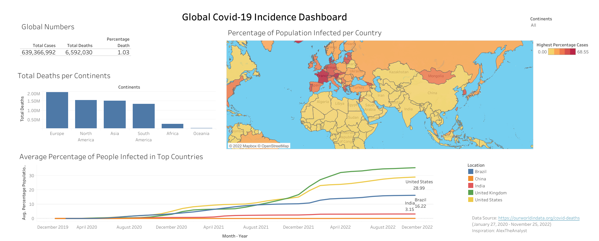

# Covid-19-Analysis---SQL

The covid-19 took the world by storm in early 2020. What started as a small localized problem in Wuhan, China spread rapidly all over the world, putting the world in turmoil. There were drastic changes we have to make to our daily living. There were a series of lockdowns, palliatives, etc. There was fresh breath to live when the covid-19 vaccine was manufactured. Finally, we can go back to our previous life, right?

In this project, I used Microsoft SQL Server 2019 to analyze the global covid-19 dataset from [ourworldindata](https://ourworldindata.org/covid-deaths). The dataset span from January 27, 2020 to November 25, 2022.

## FINDINGS

* Total cases against Total Deaths – This query returns the progressive number of cases, death, and percentage of death recorded per day for each country

* Total Covid Cases against Population - This query returns the population, total number of cases, and percentage of cases recorded per day for each country

* Countries with the highest infection rate to population – This query shows countries, their population, total infections, and the highest percentage of infection. (Cyprus has the highest infection rate to the population to date at 68.56%)

* Countries with highest death count per population – This query returns the countries, population, and Total deaths from Covid-19. (United States of America has the total highest death which is 1,079,196)

* Continents with highest death count per population – The death count from each continent was also queried. Europe has the highest death count of 1,979,302 followed by North America with 1,536,014

* Total cases and death to date – The global Covid-19 cases is 639366992, the total death resulting from covid-19 is 6592030, and the percentage of death stands at 1.03%

* Total Vaccination to Total Population – This query returns the continent, country, date, population, and new vaccinations per day.

* Total Vaccination as a percentage of the population - This query returns the continent, country, date, population, new vaccinations, cumulative count of vaccinations, and percentage of people vaccinated per day.

## Dashboard Creation

Tableau Public was used to visualize this data.

You can see the dashboard by following this [link](https://public.tableau.com/views/Covid-19Dashboard_16695628198640/Covid-19Dashboard?:language=en-US&:display_count=n&:origin=viz_share_link).

